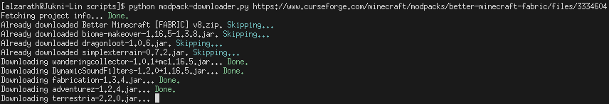

# Minecraft Modpack Downloader

Command-line Python downloader for Minecraft modpacks.

## Requirements

* [python-requests](http://python-requests.org/)
* [python-slugify](https://github.com/un33k/python-slugify)

## Usage

```sh
usage: modpack-downloader.py [-h] [-f] VALUE

Downloads full Minecraft modpacks from Curseforge.

positional arguments:
  VALUE        URL or ID for the modpack

optional arguments:
  -h, --help   show this help message and exit
  -f, --force  Forces re-downloading of all files.
```


